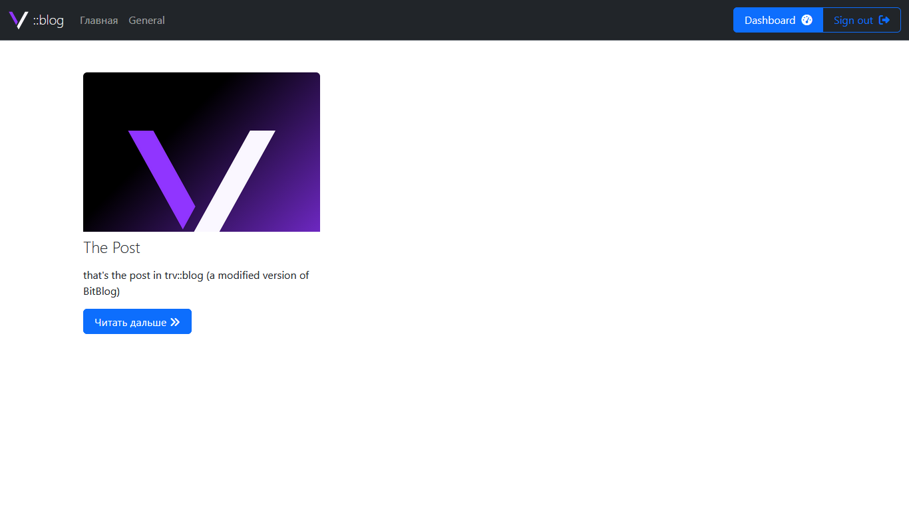
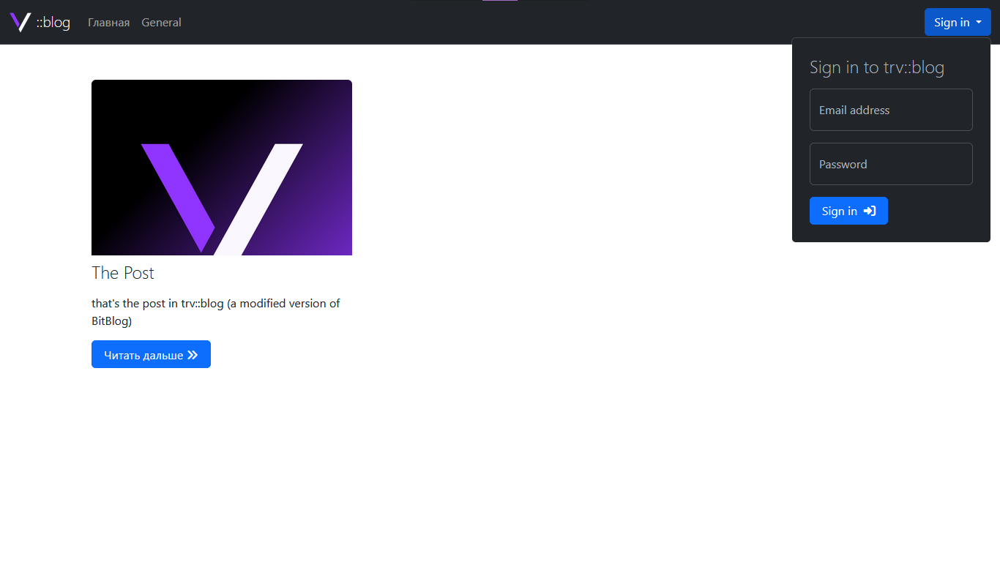

# trv::blog
лёгкий PHP блог

## что использовано
- PHP 8.1.10

## фичи
что уже готово:
- создание, просмотр, редактирование и удаление постов
- изменение статуса поста (активный и неактивный)
- создание, изменение и удаление категорий

## скриншоты

## установка
1. установите XAMPP

2. включите Apache и MySQL через XAMPP Control Panel

3. клонируйте репозиторий в `C:\xampp\htdocs\`: `git clone https://github.com/4vanyek/trvblog.git`
4. зайдите в phpMyAdmin (`localhost/phpmyadmin`)
5. создайте базу данных с именем `trvblog`
6. импортируйте файл `bit-blog.sql` в эту базу данных
7. откройте trv::blog в браузере: http://localhost/trvblog/
8. войдите в аккаунт:
- Email = admin@gmail.com 
- Password = 123456

### создано [MobinaJafarian](https://github.com/MobinaJafarian) и [4vanyek](https://github.com/4vanyek)

